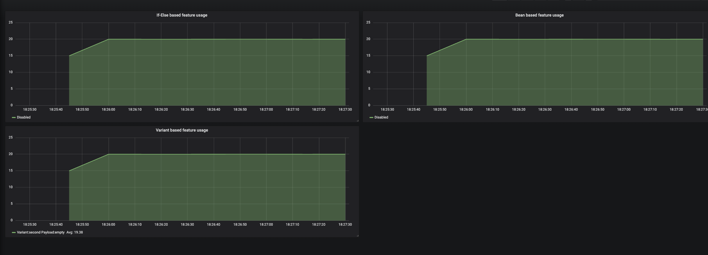
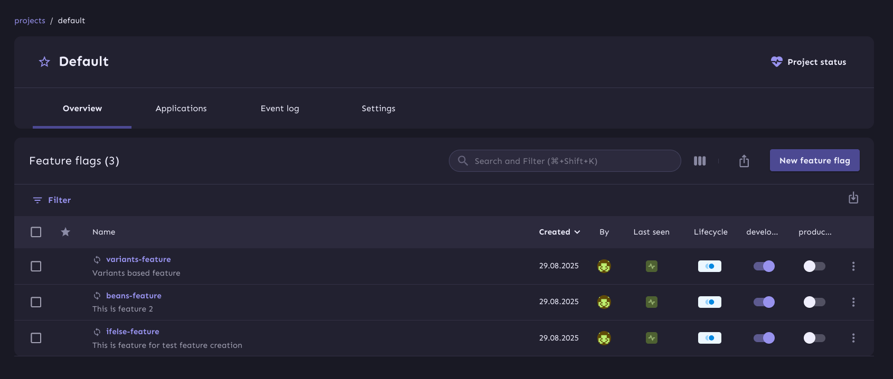
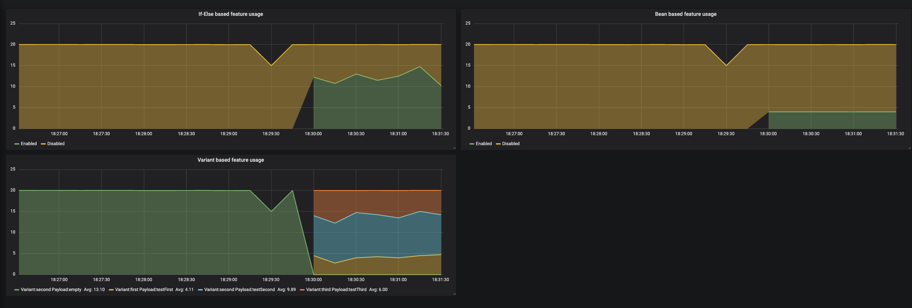

Text was translated by AI. See original [README_RU](README_RU.md)
# Unleash demo

This is a project to demonstrate the capabilities of Unleash for a service using Java + Spring.

## Running
To run, execute:
```bash
docker-compose -p unleash-demo up -d
```

After the containers start, go to Grafana at http://localhost:3000. The default login and password are admin/admin.
Go to the _Dashboards -> Manage -> default -> Feature flags dashboard_ tab.
There you should see the following:



❗If the panels are empty, it means an error occurred somewhere; please report this in Issues.

By default, all toggles are disabled, so the features are disabled for all users. Let's enable them:
Go to Unleash at http://localhost:4242. The default login and password are **admin/unleash4all**.
Next, go to _Projects (on left panel) -> Default_. Three created features should be displayed there. Enable all of them for the Development environment.



After enabling the toggles, the metrics in Grafana should change approximately like this:



These graphs demonstrate the portion of users for whom the features are available.

## Containers:
### Server
The server handles 3 REST endpoints, each checking a feature toggle:
1.  **ifelse-feature** - check using simple if-else syntax.
    Context fields are set directly in the `unleash.isEnabled()` call. The `age` field is unique to this feature.
2.  **beans-feature** - check using a Spring proxy over two different beans.
    Context is taken from a custom UnleashContextProvider, which is populated via AOP.
3.  **variant-feature** - checks the feature toggle using a Spring proxy over several variant beans.
    The "second" variant is enabled by default and triggers if the toggle is off.
    The metric outputs the payload value for the current variant in the `payload` tag.

### Client
Every second, it generates several (20 by default) test users. Each user has a tariff, age, and name.
Each user calls all three REST endpoints on the server. Thus, the total load on the server is: *users * 3*.
That is 60 by default.

### Grafana + Prometheus
*   **Prometheus** - http://localhost:9090, scrapes metrics every second.
*   **Grafana** - http://localhost:3000, admin/admin. Displays metrics from Prometheus.

## Test Data
User distribution by tariff:
*   PRO - 6
*   ULTIMATE - 3
*   VIP - 1
*   FREE - all others (10 by default)

Age - a random number from 0 to 100.

Name - five users have fixed names: user1, user2, user3, user4, user5. All other names are random.
The number of users can be changed in the `USERS_COUNT` variable in docker-compose.yaml.

By default, the following conditions are added for the features:
*   **ifelse-feature** - all users older than 40.
*   **beans-feature** - all users with ULTIMATE and VIP tariffs.
*   **variants-feature** - all users are distributed into 3 groups in a 2/5/3 ratio.

A segment of 5 beta-testers with names `user*` is also added. You can try using it in the strategy of any feature.

To demonstrate Unleash's operation, you can:
*   Change strategy conditions, add multiple conditions for one feature.
*   Add multiple strategies.
*   Change the payload for variants.
*   Change the number of users. More users -> more accurate distribution.

So you don't have to manually create all the features, segments, and strategies, the project includes the unleash-agent.jar utility.
It will also roll back all your actions when the container is restarted. If you don't need this, you can remove the container.