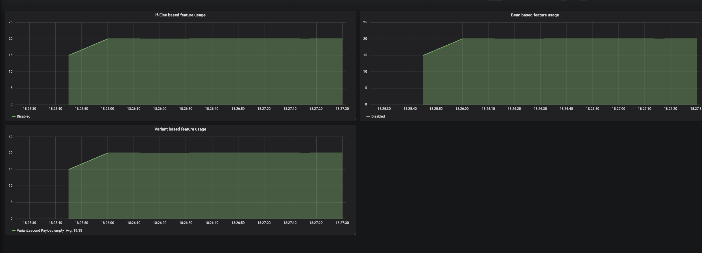
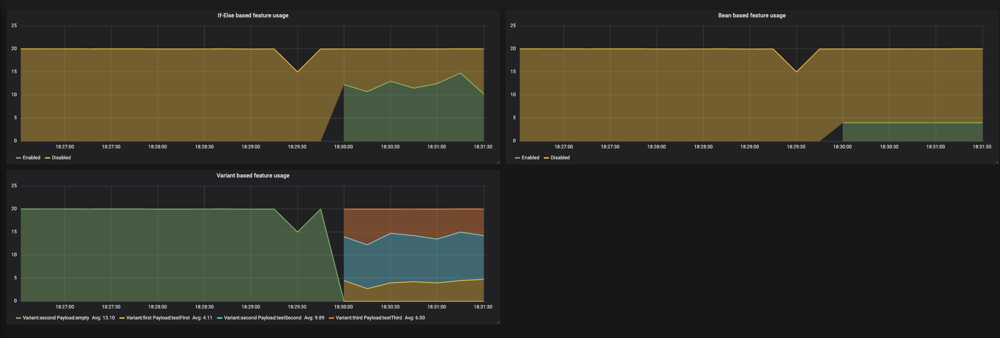

# Unleash demo

Это проект для демонстрации возможностей Unleash для сервиса использующего Java + Spring.

## Запуск
Для запуска всех компонентов выполните:
```bash 
docker-compose -p unleash-demo up -d
```

После запуска контейнеров зайдите в Grafana по адресу http://localhost:3000. Логин и пароль умолчанию - admin/admin. 
Перейдите во вкладку _Dashboards -> Manage -> default -> Feature flags dashboard_.
Там вы должны увидеть следующее:



❗ Если панели пустые, значит где-то произошла ошибка, напишите, пожалуйста, об этом в Issues.

По умолчанию все тогглы выключены, поэтому фичи выключены для всех пользователей. Давайте включим их:
Зайдите в Unleash по адресу http://localhost:4242. Логин и пароль по умолчанию - **admin/unleash4all**. 
Далее заходите в _Projects(on left panel) -> Default_. Там должны отобразиться три созданных фичи. Включите их всех для окружения Development.


После включения тогглов, в графане должны измениться показатели примерно так:



Эти графики демонстрируют для какой части пользователей доступны фичи.

## Контейнеры:
### Сервер
Сервер обрабатывает 3 REST endpoint, в каждом из которых проверяется включение фичи:
1. ifelse-feature -  проверка через простой if-else синтаксис. 
Поля контекста заполняются напрямую при вызове unleash.isEnabled(). Поле age уникально для этой фичи.
2. beans-feature - проверка через Spring proxy над двумя разными бинами.
Контекст берется из кастомного UnleashContextProvider, который заполняется через AoP.
3. variant-feature - в нем включение фичи проверяется через Spring proxy над несколькими бинами вариантами. 
По умолчанию включен вариант «второй», который срабатывает если тоггл выключен. 
В метрику в тэге payload выводится значение payload для текущего варианта

### Клиент
Каждую секунду генерирует несколько(20 по умолчанию) тестовых пользователей. У каждого пользователя есть тариф, возраст и имя.
Каждый пользователь вызывает все три REST ендпоинта у сервера. Таким образом суммарная нагрузка на сервер: _users * 3_.
То есть 60 по умолчанию.

### Grafana + Prometheus
Prometheus - http://localhost:9090, собирает метрики каждую секунду
Grafana - http://localhost:3000, admin/admin. Отображает метрики из prometheus


## Тестовые данные
Распределение пользователей по тарифам:
 - PRO - 6
 - ULTIMATE - 3
 - VIP - 1
 - FREE - все остальные (10 по умолчанию)

Возраст - случайное число от 0 до 100

Имя - у пяти пользователей имена фиксированы - user1, user2, user3, user4, user5. Все остальные имена случайные.
Количество пользователей можно изменить в переменной USERS_COUNT в docker-compose.yaml

По умолчанию для фичей добавлены условия:
- ifelse-feature - все пользователи с возрастом старше 40
- beans-feature -  все пользователи с тарифом ULTIMATE и VIP
- variants-feature - все пользователи распределяются на 3 группы, в соотношении 2/5/3.

Также добавлен сегмент пользователей 5 бета-тестеров с именами user*. Можете попробовать использовать его в стратегии любой фичи.

Для демонстрации работы Unleash вы можете:
- менять условия стратегий, добавлять несколько условий на одну фичу
- добавлять несколько стратегий
- менять payload у вариантов
- менять количество пользователей. Больше пользователей -> более точное распределение

Чтобы вам не приходилось вручную создавать все фичи, сегменты, стратегии в проекте есть утилита unleash-agent.jar.
Она также откатит все ваши действия, при перезапуске контейнера. Если вам это не нужно, можно удалить контейнер